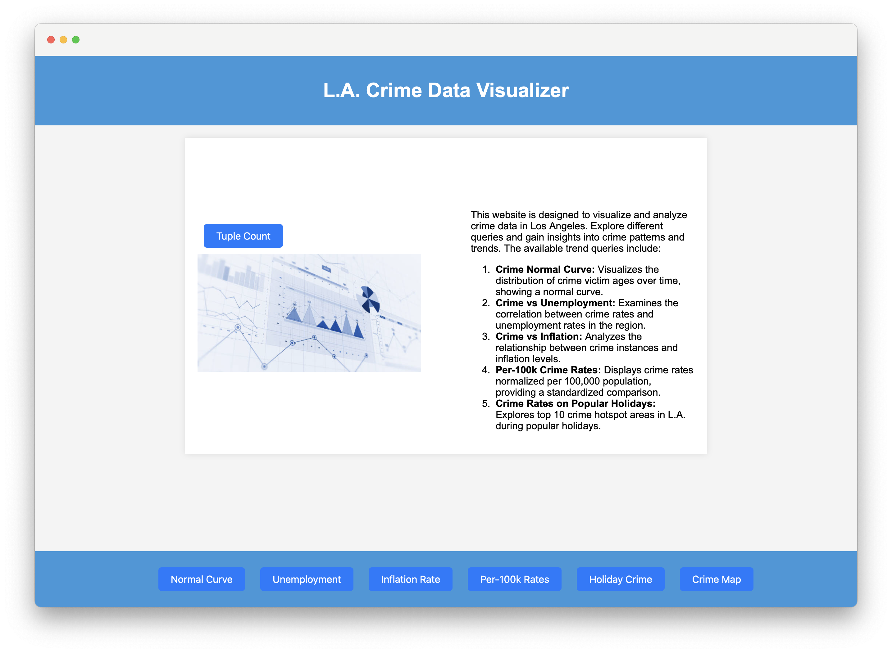
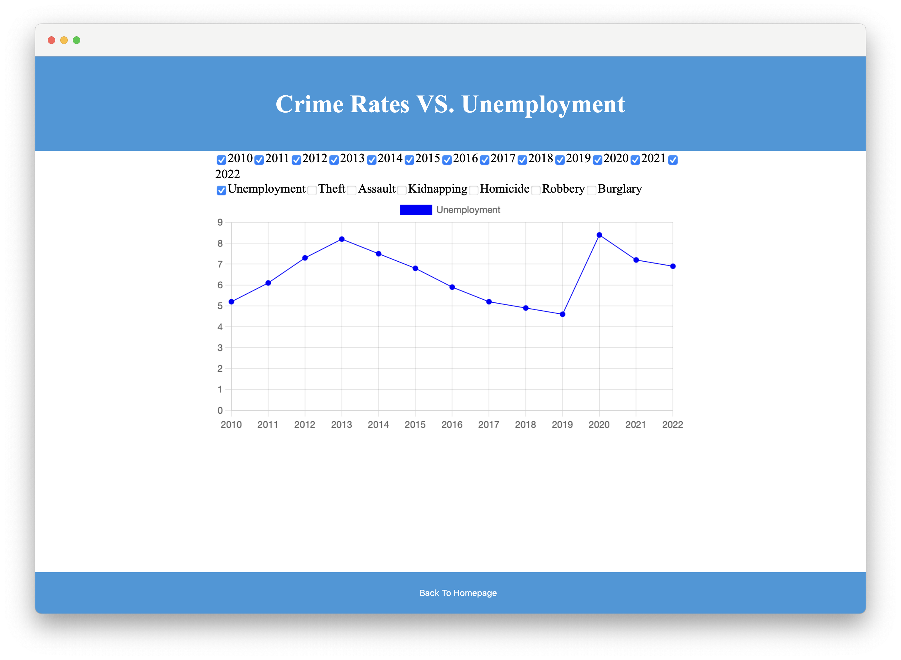
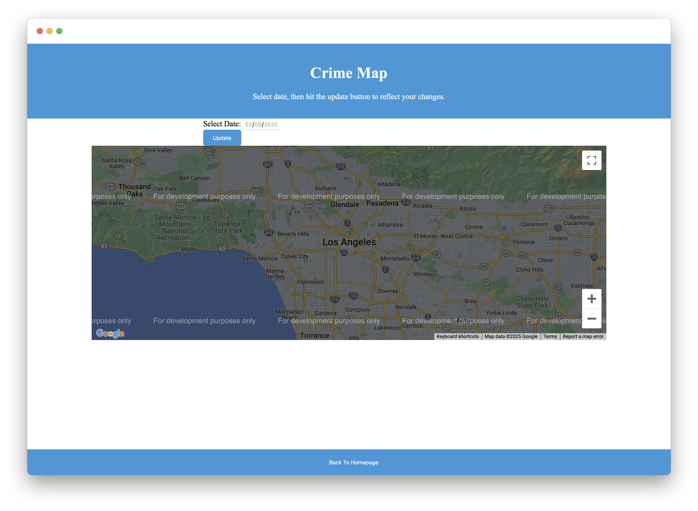

# Crime Statistics

A web-based crime data analysis tool for Los Angeles, leveraging complex trend queries to analyze crime statistics. Built with JavaScript and SQL, the application uses Chart.js for data visualization and Google Maps API for location-based insights. Users can interact with the frontend to view crime trends, generate visualizations, and explore data-driven insights. The backend queries an Oracle database to retrieve and process real-world crime data, supporting both operational and complex trend analysis. The tool is designed to better understand crime patterns and trends in Los Angeles.

## Quick Look
<div style="display: flex; gap: 0px; justify-content: center;">
    
</div>

<div style="display: flex; gap: 0px;">
    
    
</div>

## Datasets
Crime data is publicly available from the LA City website.
- [Crime Data from 2010 to 2019](https://data.lacity.org/Public-Safety/Crime-Data-from-2010-to-2019/63jg-8b9z/)
- [Crime Data from 2020 to Present](https://data.lacity.org/Public-Safety/Crime-Data-from-2020-to-Present/2nrs-mtv8/)

## Dependencies
- Node.js

## Getting Started
1. Open Terminal on the `backend` folder and run the following command to install backend dependencies.
    ```
    npm init
    ```
2. Create `.env` file inside the `backend` folder. Then, input your UF CISE Oracle credentials into the file with the following structure:
    ```
    DB_USER=
    DB_PASSWORD=
    ```
3. Connect to [Gatorlink VPN](https://it.ufl.edu/ict/documentation/network-infrastructure/vpn/)
4. Open the backend by running `app.js` from the `backend` folder with following command:
    ```
    node app
    ```
5. Run `homepage.html` inside `/frontend/pages/` to use the website.

## Disclaimer
This project is only accessible to individuals who have access to the university's database. 
[!IMPORTANT]
> If the database tables are deleted, the website will lose access to its data, requiring a reupload of the dataset.
